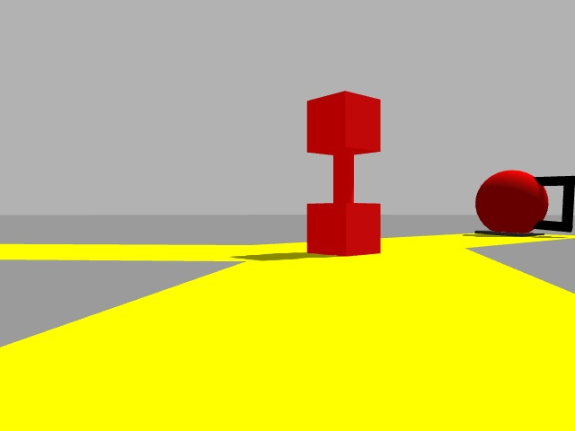

# roomba

## Team Members
Karhan Kayan, Jingyu Cai, Zack Wang, Yoon Jeong

## Testing Steps

### Q-learning
    $ roscore
    $ roslaunch roomba training.launch

### Robot perception & movement
    $ roscore
    $ roslaunch roomba room.launch

## Project Description

### Goal of the project
Given a fixed graph of yellow lines and marked-out locations for objects of interest, the goal of this project is to make the robot take the most optimal path in the graph to pick up objects and drop them off in their corresponding bins to maximize reward, which takes into account the type of the object as well as the distance it took for the robot to complete an action. In particular, we will use the Q-learning algorithm to generate an action sequence and manipulate the kinematics of the robot along with perception and computer vision to execute the actions.

### Why it's interesting?
We think that this kind of robot would be helpful in the real world - picking and sorting clothes and trash in someone's room, or even picking up garbage in a less-controlled environment. Additionally, this is a good synthesis of all the mechanics we've learned in the class, including perception, kinematics, and a reward-based algorithm.

### What were you able to make the robot do?

We were able to get the roomba to clean up two pieces of red trash (dumbbell and ball/kettlebell) and two pieces of blue trash (dumbbell and ball/kettlebell). This was achieved using a number of techniques we learned in class as well as several concepts we taught ourselves along the way. To generate the path of the robot we used Q-Learning and the Floyd Washall algorithm. To move from point to point, we use line following and PID control. To pick up the objects, we used computer vision and PID control dependent on HSV color-scales. Here is a demonstration of our robot performing its task!

![gif][demo]

Note that since there is a lot of random noise in the Gazebo simulation and that different machines seem to run the code with different resolutions (smoothness/lagginess), each test run may not perfectly replicate the demonstration above. It actually took us a few tries to record the demo, but we are pretty satisifed with the end result.

### What are the main components of your project and how they fit together?
The five main components of the project are 1) developing a fixed map with known distances between nodes and locations of objects, 2) computing the optimal paths in the graph representation, 3) training a Q-matrix with the Q-learning algorithm on the map, and executing the most optimal actions based on robot 4) perception and 5) kinematics. First, given the map and the states of the robot and the objects, we were able to create an action space and a state space to train the Q-matrix with. For reward, we took into account the type of object the robot picks up (dumbbell has the highest reward, ball/kettlebell second, and you can't pick up a cubic obstacle) and the distance it took for the robot to complete the pick up-drop off action with the Floyd-Warshall algorithm (so the robot would need to choose between prioritizing high-value objects or shortest paths). With the converged Q-matrix, we selected the most optimal action from each given state the robot is in to create an action sequence for the robot to execute so to maximize the reward, and we used the Floyd-Warshall algorithm again to convert that into the shortest path the robot would take to complete each action in the form of a sequence of nodes. The robot will use perception to follow the yellow lines to traverse the map, and use its arm and gripper to pick up and drop off objects at bins with the same colors. To add complexity to the project, we also used computer vision to identify the type of object the robot is going to pick up without previous knowledge of what object is at each node (in other words, the robot only knows what path to take but doesn't know what arm and gripper action to take to handle the object before the robot identifies it).

## System Architecture

### Describe in detail the robotics algorithm you implemented
The main algorithm we implemented is the Q-learning algorithm, where we trained a Q-matrix by randomly choosing actions for the robot to take with a given state. We defined the action and state spaces discretely and minimalistically since the number of permutations can get really large. The actions specify the type, color, and location of the object to be picked up and states specify the location of the robot (which node it is on) and the states of each object (whether it is at its starting place or in a bin), and we integrated them into an action matrix so we can easily identify which action transitions which state. We also have a reward callback that updates the Q-matrix values with each action, and we iterate through the Q-learning algorithm until the Q-matrix converges under a certain threshold. With the trained Q-matrix (which is a matrix of action-state pairs), we start from the origin position of the robot and chooses the action that has the highest Q-value in a given state and move onto the next state, and we continue iterating until all non-obstacle objects are successfully sorted. Therefore, we have generated an action sequence, which we converted into a sequence of nodes that produces the shortest path for the robot to follow with the Floyd-Warshall algorithm.

### Describe each major component of your project and highlight what pieces of code contribute to these main components

#### Map and Modeling

- **Making and Encoding the Graph:**

The map and objects are housed in the world file “map1.world” and various model files built by Gazebo. 

#### Path Finding

- **Finding the Optimal Path in Graph Representation:**

We needed to implement an optimal path finding algorithm for both the calculation of reward in the training phase and navigating the map in the execution phase. To do this, we represented the map abstractly in graph form using its adjacency matrix. Then we calculated the shortest paths using the Floyd Warshall algorithm. This is a dynamic programming based algorithm that calculates the distance between each pair of nodes in a weighted graph by considering the intermediate nodes the shortest path can go through. We modified the algorithm to also print out the list of nodes for the shortest path between each pair of nodes. 

- The code for path finding is located in the distances folder in `compute_distances.py`. We read the adjacency matrix provided by the user and preprocess it to give infinity weights to edges that do not exist. 
- The `floyd_warshall()` function takes in the preprocessed adjacency matrix as the argument and returns the shortest distances and paths based on the Floyd Warshall algorithm. 
- `find_shortest_path()` uses the subsequent node information for each pair of nodes to recursively calculate the list of nodes for the shortest paths. 
- The shortest distances are saved to `distances.npy` and the shortest paths are saved to `shortest_paths.txt`.

#### Q-Learning

- **Defining the States and the Actions:**

Our definition of a state involved both the location of the robot and the location of each object. The location of the robot was encoded as the node it is currently at in the graph and the locations of each object was encoded as whether or not they are placed in the correct bin (0 or 1). So, for instance a state (4,1,0,1) would indicate that the robot is at node 4, the first object is correctly placed in its bin etc. The reason why we include the robot's location in the states is that we need the robot's location to calculate the distance it has to travel to pick up an object, which affects the reward.

- The code for defining and generating the states, and the state action matrix is in `generate_action_states.py` in the action_states folder. The actions and states are generated based on the information that the user provides about the representation of the map as a graph and generalizes to any map.   
- The function `read_objects_and_bins()` reads the user input object and bin information in the corresponding csv files to be used to generate the state-action matrix. These files contain the type, color and the location of each object and bin. 
- The function `generate_states()` then generates all possible states using the cartesian product of each object state and robot location. If there are n nodes and m objects in the map, then the number of states is n*2^m. 
- The function `generate_action_matrix()` then generates the state-action matrix by considering what action takes us to which state based on the object and current state information. The generated states and state-action matrix are then saved to `states.csv` and `action_matrix.csv`. 

- **The Reward Function:**

The reward function that we used for Q-Learning considers both the distance the robot has to travel to put an object to a bin and the reward associated with that object type. The dumbbells have 100 points, and the balls have 50 points of reward each. The distance that the robot has to travel is discounted from the published reward to encourage picking up closer objects. So, for instance if the robot has to travel 10 meters to put a dumbell in its place, then the reward is 100 - 10 = 90. 

- The code for the reward publication is in `reward.py` and uses the custom message `QLearningReward.msg`.
- `__init__()` initializes reads the object and bin information from the corresponding csv files and initializes the rewards. It also reads the distances between each pair of nodes precomputed by the Floyd-Warshall algorithm and stored in `distances.npy`.
- Each time a robot action is published, `send_reward()` is called, which calculates and publishes the reward that is described above. And the world is reset when all objects are moved into place. 

- **Q-Learning Algorithm:**

Similar to the Q-learning project, the Q-learning algorithm in this project uses the action matrix to first choose a random action starting from the origin state, then receive the reward to update the Q-matrix, and finally move onto the next state. This training process would continue until the Q-matrix converges under a certain threshold for a specific amount of iterations, which we tuned to ensure a sufficient convergence without having to train a really large number of iterations. Lastly, we generated an action sequence from the Q-matrix by starting from the origin state and taking the action that has the highest Q-value until all the non-obstacle objects are moved. Then, using the Floyd-Warshall algorithm, we also converted that action sequence into a sequence of nodes for the robot to orient towards and follow. By inspecting the Q-matrix and the action and node sequences over many training sessions, they all seem to be very similar and make sense in terms of producing the most optimal actions from each state.

The code for the Q-learning algorithm is located in `q_learning.py`:
- `init()`: In here, we set up the necessary variables for selecting and executing actions for the robot/phantom robot, including the publishers for `QMatrix()` and `RobotAction()`, the action matrix, actions, and states from the pre-defined files, and variables to keep track of the robot's state. We also initialized the Q-matrix and published it, and chose a random action to begin. 
- `initialize_q_matrix()`: In here, we assigned every cell within the Q-matrix with a value of 0 to start.
- `select_random_action()`: In here, we identified the valid actions to take given a current state from self.action_matrix, and randomly selected one of those actions using numpy's `choice()` function. Then, after updating what the next state would be for the selected action, we published the object, color, and the node number via a `RobotAction()` message for the robot/phantom robot to execute.
- `update_q_matrix()`: In here, we used the Q-learning algorithm to update the Q-matrix given a particular state and action, and is called in `reward_received()` whenever there is a reward callback. After each update, we checked if the Q-value change is above or below the defined self.epsilon from `init()`. If it is below, we increase our count of the `self.static_tracker`. Otherwise, we set the tracker value back to 0.
- `is_converged()`: This checks if the number of static iterations meet `self.static_iter_threshold`.
- `reward_received()`: This integrates the above functions to check if the Q-matrix has converged after every reward callback, and saves the matrix to `q_matrix.csv` if it has converged or keep taking random actions if otherwise.

The code for converting the converged Q-matrix into the action and node sequence are located in `kinematics.py`:
- `get_action_sequence()`: After loading the converged q_matrix.csv, we will iterate through each state, beginning with 256 (when robot is at the origin) and choose the largest Q-value as the action to take. We will append each action onto the `self.action_sequence` array containing elements of tuples in the form of (obj, clr, node)
- `get_node_sequence()`: After computing the shortest paths between each nodes using the `floyd_warshall()` function from `compute_distances.py`, we will find where the robot’s current node is and which node it should go next to pick up an object from `self.action_sequence` and convert that into a sequence of nodes that represents the shortest path between the two nodes, then we will find the sequence of nodes that represents the shortest path between the node of the object and the node of the bin. We append the two sequences as one object onto the `self.node_sequence` array to indicate a complete action, and we iterate through the `self.action_sequence` until all actions are converted into sequences of nodes.

#### Perception

- **Computer Vision for Object Identification:**

For the computer vision component, the goal was to discern whether the object in front of the robot is a kettlebell or a dumbbell. It is used in the execution phase to inform the kinematics actions used to pick up the detected object. To achieve this, the vision algorithm first masks the image obtained from robot's camera using to only have certain colors that the objects can have, and paints the other pixels to white. The image is then thresholded and the contours are extracted using a boundary following algorithm. We then loop through each contour and approximate it with a polygon using the Ramer-Douglas-Peucker algorithm. The intuition is that the kettlebell should be approximated by a higher number of vertices than the dumbbell as it is circular. So, we use the number of approximated vertices to classify a contour as a kettlebell or a dumbbell. One issue that we also had to handle was the presence of multiple shapes in the image. Because we always follow a line to pick up an object, the objects we want to detect are centered in camera. So, we calculate the center of each shape, then calculate its distance to the camera center, and then take the one closest to the camera center. 

The code for perception is located in `vision.py` and it is a rosnode that publishes the type of the detected object. 
- `__init__()` initializes the node and sets up the camera subscriber and detected object publisher. 
- `get_mask()` isolates the image to only contain pure red, pure green, and pure blue pixels. This has to be done to avoid detecting shadows as shapes. 
- `invalid_contour()` takes a contour as an argument and determines if its borders contain image borders. We want to avoid this because sometimes the shape detection algorithm confuses the borders of the shape with the borders of the image. The way that we check for this is we get the bounding rectangle for the contour and compare it the rectangle for the whole image. If they are close in size, then the contour is invalid. 
- `detect_shape()` is the main function we use to determine the shape detected in the image. It first preprocesses the image, by getting the masks and getting rid of the black pixels. Then runs the shape detection algorithm described previously. The invalid contours are eliminated, and the type of the closest shape to the center is published. 
- `image_callback()` takes the camera feed and sets `self.image` to that. 
- `run()` runs the rosnode. 

Below is an example of the original image, preprocessed image, and the shape detected image:

  
   
  

- **Perception Integration with Kinematics:**

The robot uses perception from its camera, which integrates with kinematics to follow the yellow lines of the graph and use computer vision to identify the objects for pick-up actions and the colored zones drop-off actions.

The code for perception integration is located in `kinematics.py`:
- One layer of abstraction above the kinematics components were the functions `follow_yellow_line`, `approach_and_pickup_dumbbell`, `approach_and_pickup_kettlebell`, `drop_off_object` which each use computer vision to perform their operations. `follow_yellow_line` uses virtually the same code as in the Lecture code it was taken from with PID as its main feature. `approach_and_pickup_*` functions use PID to hone in on the handle of the object, and then perform the `pick_up` function described previously. The `drop_off_object` uses a mixture of computer vision and PID to get close to the drop off zone, then drops the object using the `let_go` function.

#### Kinematics

- **Orienting the Robot Towards a Node:** 

Given the node sequence, the robot would need to first orient itself to face the next node that it is going to travel to. To do so, we subscribed to the pose of the robot and used trigonometry to calculate the angle it needs to turn to face the position of the desired node.

The code for orientation is located in `kinematics.py`:
- `get_yaw_from_pose()`: This takes in a `Pose()` objects and converts the orientation values into the yaw of the robot
- `get_target_angle()`: This calculates the amount of angle the robot needs to turn to face the node, which is done by using trigonometry to first find the raw/absolute angle between the robot and the node and then takes into account the relative position of the node to the robot to compute the target angle.
- `orient()`: This function generalizes the orient action of the robot to make it able to turn to any node based on its current position (which is fetched by the pose subscriber in `odom_callback()`) and the position of the node (which is read from `locations.csv` into the script as `self.locations`). Then, by using the two helper functions above, we calculate the difference between the robot’s yaw and the target angle and apply proportional control to turn the robot until it faces the node within a few degrees. Once the robot is within this window, we signal to move to the line follower phase. 

- **Kinematics for Movement and Handling Objects:** 

The robot is fine-tuned to move around the map and use its arm and gripper to handle different objects, which is tightly integrated with perception to execute the action sequence.

The code for kinematics is located in `kinematics.py`:
- Granular movements functions `stop`, `move_forward`, `move_back`, `turn_left`, `turn_right` were used to control the Twist of the robot. This aided greatly by minimizing the friction that often comes with having to write repeated lines of code to move the robot.
- Granular movements for arm motion such as `lower_arm`, `upper_arm`, and `angle_arm` were responsible for the ready position, the raised position, and the raised-angled position (so the dumbbell would be out of the way of the camera).
- The above granular movements were then combined to create complex operations such as `pick_up`, `let_go`, `go_around`. These each performed the compound movements required to pick up and let go of objects, go around obstacles, and drop off the object.
- The `move_to_node` is further a layer of abstraction above these, as it uses the `object_action_router` to determine which of the above object control functions to use. The `follow_yellow_line` function is used throughout to move from node to node. Aside from these functions, the `move_to_node` also integrates the `orient` function to be in the correct angle to move towards the next node.
- Note that sometimes the robot may not successfully pick up a dumbbell or a kettlebell, and this may subsequently generate unwanted behaviors. We tried our best to fine tune these pick-up actions, but due to random noise in Gazebo, they don’t work perfectly everytime.

## Challenges, Future Work, and Takeaways

### Challenges
One of the biggest challenges we faced in the beginning was defining the state space. We wanted to take into account the location of the robot in figuring out the most optimal path, but the robot could also be anywhere in space, so we decided to base everything on a fixed graph to avoid dealing with a continuous state space. But even when creating the state space discretely, we found that it may still produce a really large number of permutations, which may make the Q-matrix take a very long time to converge. So we discussed a lot amongst ourselves and with Sarah to come up with the most optimal way to define the state space with limited but sufficient information. Also, although the robot considers many aspects during the training phase, we didn't want to give away too much information to it during the execution phase, which we were able to solve by adding complexity to the project with computer vision. Last but not least, another challenge was the limited time frame of the project as there were a lot of moving parts and it took a while to integrate everything together. We were able to get everything in the solid end result done, including all the algorithmic, perception/computer vision, and kinematics components etc. with added complexity than previous projects, we just did not have enough time to generalize this to and test on a bigger map. However, the main code/concepts are all modularly laid out and extensively tested, so we feel confident that this would translate pretty well into a bigger map.

### Future work
If we had more time, it would be fun if we could expand the map and add more colors and objects, which may generate a more complex action sequence as the robot now has to evaluate more circumstances and their respective pros and cons. Also, it would be cool if we could give more freedom to the robot to move around without following the yellow lines. This may result in a continuous state space that may need to be simplified into discrete ranges, but it may also increase the efficiency of the robot since it doesn’t have to follow set paths anymore. Furthermore, we can add complexity to the project by penalizing the robot everytime it has to circle around an object when passing a node, which may be interesting to see since the robot now has to decide whether to take a shorter but more obstructed path or a longer but clearer path. Similar tensions like this can also be added, which may be used to simulate more real-life scenarios with complex pros-cons balances.

### Takeaways
- The first takeaway is that for a big project like this with many individual components that require a lot of integration, it is very important to get everyone on the same page. This can be done with clear code comments, updating each other with what they are doing/have done, and periodic meetings to summarize the progress and make plans for next steps. By doing so, it can save a lot of time and energy wasted on potential misunderstandings and improve the overall efficiency of the group dramatically.
- The second takeaway is that Q-learning and RL in general can be used to generate really interesting and complex behaviors based on how we define actions, states, and rewards. However, to realize those behaviors, it requires a lot of fine tuning of the actual execution of the robot, which works in a less controlled environment than what the algorithms assume. So again, this highlights the tight integration between the major components of our project, which we put a lot of thought and effort into.
- The third takeaway for this project, and this class in general, is that it would be much better if it’s done in-person rather than remote. We experienced a lot of technical difficulties along the way, such as accessing the remote machine, which stalled our progress by quite a bit. Furthermore, it would be really cool if we can physically see the robot perform the actions in-person and get a sense of how it’s different from the simulation in Gazebo.

[demo]: ./media/shortroomba.gif
